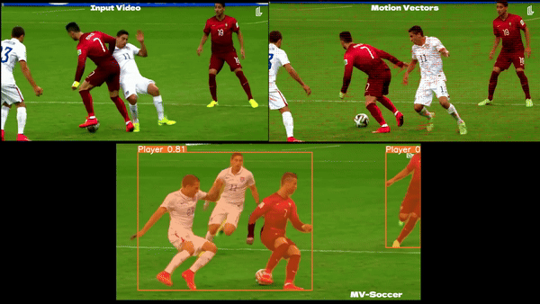

# MV-Soccer Demo Page:-
<a></a> <br>
- Clone the repository
```
git clone https://github.com/MrFahad/MV-Soccer.git
```
- Goto the cloned folder.
```
cd mv-soccer/Demo
```
- Create a Virtual Environment:
```
## For Linux Users
python -m venv mv-soccer
source mv-soccer/bin/activate

## For Windows Users
python -m venv mv-soccer
activate
```
- Install the required libraries:
```
!pip install -r requirements.txt
```

## Model:
- Download the model and place it in the Demo/models folder.
> [Model](https://tinyurl.com/vszdd2ju)

## Run the App:
``` 
streamlit run main.py
```
Enjoy the app in localhost:8501
