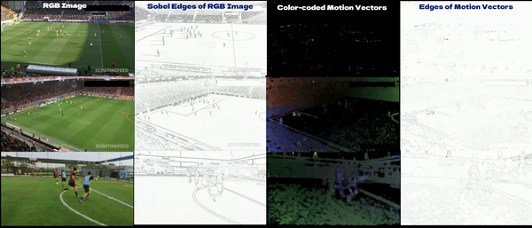
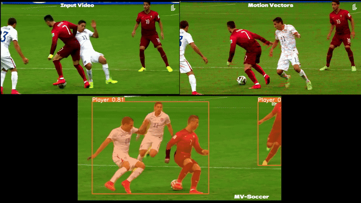

# [MV-Soccer: Motion-Vector Augmented Instance Segmentation for Soccer Player Tracking](https://github.com/MrFahad/MV-Soccer/) <br> <a></a>

> MV-Soccer: Motion-Vector Augmented Instance Segmentation for Soccer Player Tracking  
> [Fahad Majeed](https://www.linkedin.com/in/fahad-majeed/),  [Google Scholar](https://tinyurl.com/38jbwxvx)  
> CVPR 2024  <br>
<a></a> <br>

### Abstract:
This work presents a novel real-time detection, instance segmentation, and tracking approach for soccer videos. Unlike conventional methods, we augment video frames by
incorporating motion vectors, thus adding valuable shape cues that are not readily present in RGB frames. This facilitates improved foreground/background separation and 
enhances the ability to distinguish between players, especially in scenarios involving partial occlusion. The proposed framework leverages the Cross-Stage-Partial Network53
(CSPDarknet53) as a backbone, for instance segmentation and integrates motion vectors, coupled with frame differencing. The model is simultaneously trained on two publicly 
available datasets and a private dataset, SoccerPro, which we created. The reason for simultaneous training is to reduce biases and increase generalization ability. 
To validate the effectiveness of our approach, we conducted extensive experiments and attained 97% accuracy for the DFL - Bundesliga Data Shootout, 98% on the SoccerNet-Tracking dataset, 
and an impressive 99% on the SoccerPro (our) dataset. <br>

<a></a> <a></a> <br>

## About

Fahad Majeed, PhD from HBKU, Qatar, develops this software. The motion vector extraction component is sourced from Lukas Bommes' repository, [MV-Extractor](https://github.com/LukasBommes/mv-extractor) 

#### License

This project is licensed under the MIT License - see the [LICENSE](LICENSE) file for details.

#### Citation
If you find our work interesting, please cite below:

```
@InProceedings{Majeed_2024_CVPR,
    author    = {Majeed, Fahad and Gilal, Nauman Ullah and Al-Thelaya, Khaled and Yang, Yin and Agus, Marco and Schneider, Jens},
    title     = {MV-Soccer: Motion-Vector Augmented Instance Segmentation for Soccer Player Tracking},
    booktitle = {Proceedings of the IEEE/CVF Conference on Computer Vision and Pattern Recognition (CVPR) Workshops},
    month     = {June},
    year      = {2024},
    pages     = {3245-3255},
    url       = {https://tinyurl.com/5cyschua}
}
```
