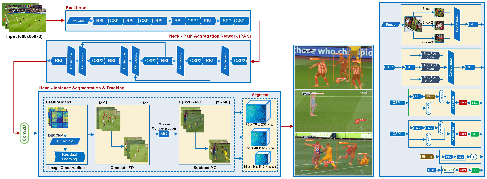

# [MV-Soccer: Motion-Vector Augmented Instance Segmentation for Soccer Player Tracking](https://arxiv.org/abs/2303.08340)
<!-- ### [Project Page](https://drinkingcoder.github.io/publication/flowformer/)  -->

> MV-Soccer: Motion-Vector Augmented Instance Segmentation for Soccer Player Tracking  
> [Fahad Majeed](https://www.linkedin.com/in/fahad-majeed/),  [Jens Schneider](https://scholar.google.com/citations?hl=en&user=em4IRO4AAAAJ&view_op=list_works&sortby=pubdate)  
> CVPR 2024  <br>
<a></a> <br>

##### Motion Vectors

H.264 uses different techniques to reduce the size of a raw video frame before sending it over a network or storing it into a file. One of those techniques is motion estimation and predicting future frames based on previous or future frames. Each frame is split into 16-pixel x 16-pixel large macroblocks. During encoding, motion estimation matches every macroblock to a similar-looking macroblock in a previously encoded frame (note that this frame can also be a future frame since encoding and playout order might differ). This allows the transmission of only those motion vectors and the reference macroblock instead of all macroblocks, effectively reducing the amount of transmitted or stored data. <br>
Motion vectors correlate directly with motion in the video scene and are useful for various computer vision tasks, such as visual object tracking.

##### Frame Types

The frame type is either "P", "B", or "I" and refers to the H.264 encoding mode of the current frame. An "I" frame is sent fully over the network and serves as a reference for "P" and "B" frames for which only differences to previously decoded frames are transmitted. Those differences are encoded via motion vectors. Consequently, this library returns no "I" frame motion vectors. The difference between "P" and "B" frames is that "P" frames refer only to past frames, whereas "B" frames have motion vectors which refer to both past and future frames. References to future frames are possible even with live streams because the decoding order of frames differs from the display order.

## About

Fahad Majeed, PhD from HBKU, Qatar, develops this software. The motion vector extraction component is sourced from Lukas Bommes' repository, [MV-Extractor](https://github.com/LukasBommes/mv-extractor) 

#### License

This project is licensed under the MIT License - see the [LICENSE](LICENSE) file for details.


#### Citation

If you use our work for academic research, please cite

```
@INPROCEEDINGS{MV-Soccer,
  author={F. {Majeed} and J. {Schneider}},
  booktitle={10th International Workshop on Computer Vision in Sports (CVsports) at CVPR 2024}, 
  title={MV-Soccer: Motion-Vector Augmented Instance Segmentation for Soccer Player Tracking}, 
  year={2024},
  volume={},
  number={},
  pages={},
  doi={}}
```
